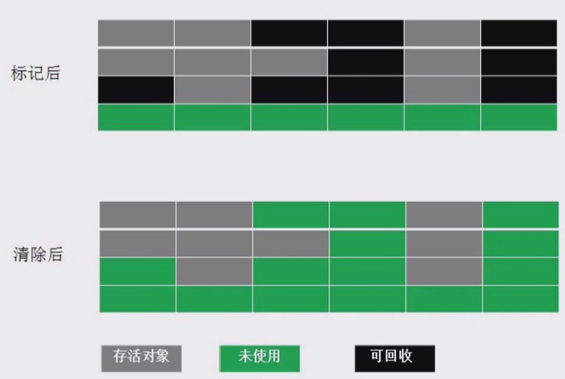
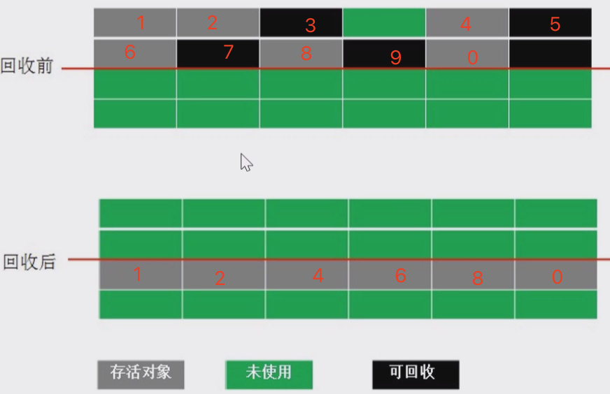
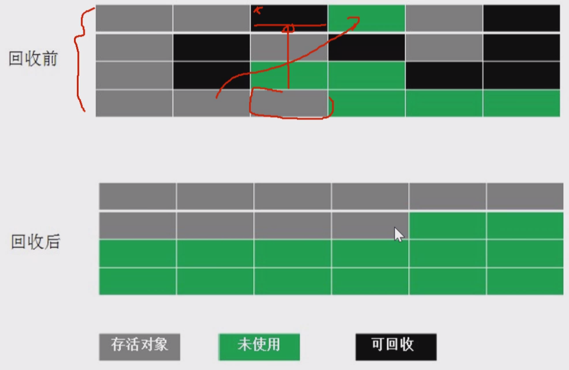
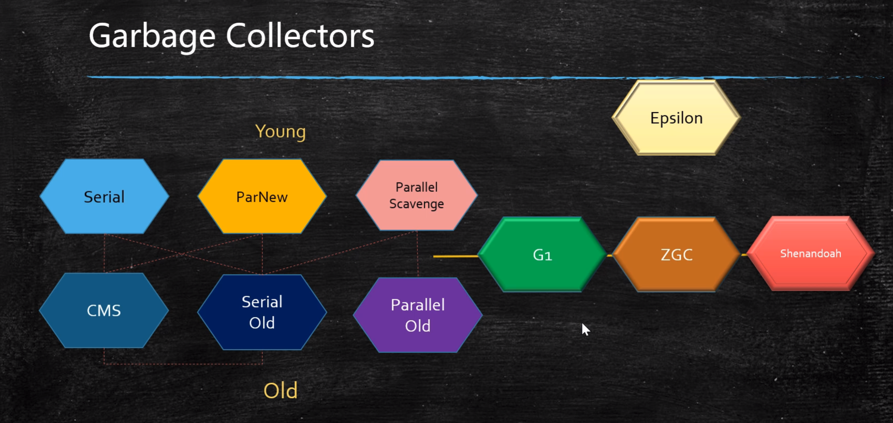
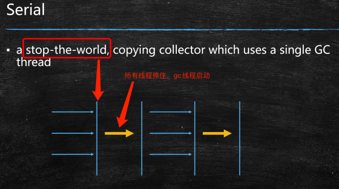
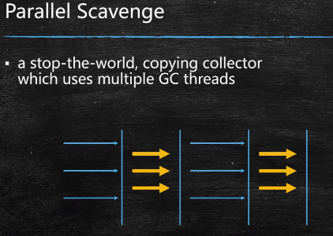
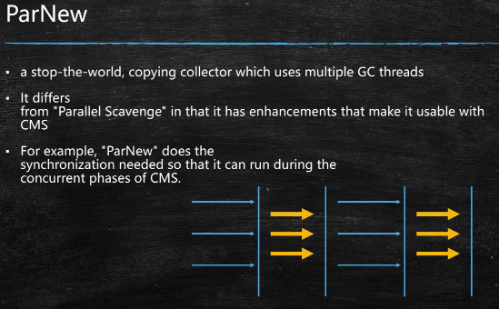
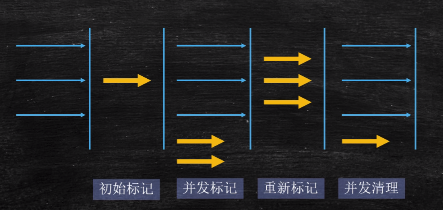
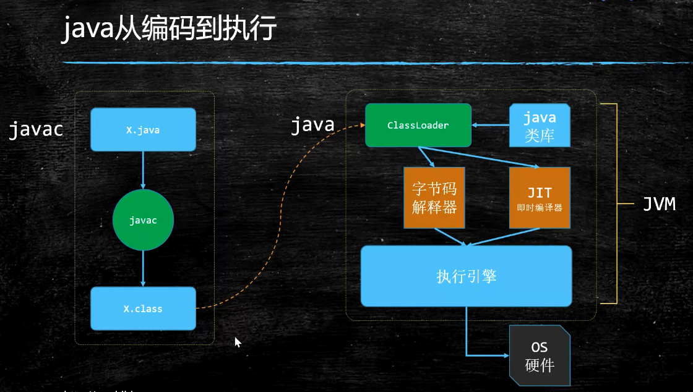

# 基础

## 什么是垃圾

- C：malloc free
- C++：new delete
- java：new ？
  - 自动内存回收，容易出现两种问题：忘记回收、多次回收

没有任何引用指向的一个对象或者多个对象（循环引用），那么它就是垃圾

循环引用：A -> B -> C -> A 

## 如何确定垃圾

1. 引用计数：reference count，不能解决循环引用问题
2. 根可达算法（根搜索算法）
   - 根对象：GC roots，这些不是垃圾
     - JVM stack：线程栈变量
     - native method stack：本地方法栈，JNI指针
     - run-time constant pool：常量池
     - static references in method area：静态变量
     - Clazz

## 常见的垃圾回收算法

1. 标记清除：Mark-Sweep，位置不连续，产生碎片

   

2. 拷贝算法：没有碎片，浪费空间

   

3. 标记压缩：没有碎片，效率偏低(任何一块挪动，都需要线程同步)

   

## JVM内存分代模型

用于分代垃圾回收算法，部分垃圾回收器使用的模型

1.8：新生代 : 老年代 = 1 : 2

1. 新生代 + 老年代 +   永久代(1.7)/元数据区(1.8 Metaspace)
   1. 永久代/元数据： Class对象
   2. 永久代必须指定大小限制 ，元数据可以设置，也可以不设置，无上限（受限于物理内存）
   3. 字符串常量：1.7-永久代，1.8-堆
   4. MethodArea：方法区，逻辑概念，永久代/元数据
   5. 永久代、元数据区不归堆管
2. 新生代 = Eden(80%) + 2个suvivor区(暂叫s0:10% s1:10%)，copy算法
   1. YGC回收之后，大多数的对象会被回收，活着的进入s0
   2. 再次YGC，活着的对象eden + s0 -> s1
   3. 再次YGC，eden + s1 -> s0
   4. 实际就是两个s区来回倒
   5. 年龄足够 -> 老年代 （老的回收器:15次 CMS:6次）
   6. suvivor区装不下 -> 老年代
3. 老年代
   1. 顽固分子
   2. 老年代满了FGC(Full GC)，是整个内存FGC
4. GC Tuning (Generation), 调谐
   1. 尽量减少FGC
   2. MinorGC = YGC
   3. MajorGC = FGC

## 常见的垃圾回收器

查看jdk 默认GC版本：java -XX:+PrintCommandLineFlags -version / jinfo PID

JDK诞生 Serial追随，提高效率 诞生PS，配合CMS 诞生PN

CMS是1.4后期引入，CMS是里程碑式的GC，它开启了并发回收的过程，但是CMS毛病较多，因此目前任何ー个JDK版本**默认都不是CMS**

并发(Parallel)垃圾回收是因为无法忍受STW



1. S + SO

   1. Serial 年轻代 串行回收

      safe point 安全点才能STW（stop-the-world）

      单线程：黄色

      

   2. Serial Old : 老年代 mark-sweep-compact

2. PS + PO

   1. PS 年轻代 并行回收，大部分此为默认

      

   2. ParallelOld ：a compaction collector that uses multiple GC threads

3. PN + CMS

   1. ParNew 年轻代 配合CMS的并行回收 (Parallel New)，PS变种 为了配合CMS

      

   2. CMS：ConcurrentMarkSweep 老年代 并发的， 垃圾回收和应用程序同时运行，降低STW的时间(200ms)

      1. 三色标记 + Incremental Update
      2. 并发标记最慢，占80%时间
      3. 问题：架构一期110 2:15:00
         1. MF
         2. FG

      

4. G1(10ms) 

   1. 1,7 刚出不完善，1.8首个完善版本，1.9默认
   2. 三色标记 + SATB

5. ZGC (1ms) PK C++

   1. ColoredPointers + 写屏障？

6. Shenandoah

   1. ColoredPointers + 读屏障？

7. Eplison 调式JVM使用

调优就是调1、2、4、5。因为 1.8默认的垃圾回收：PS + ParallelOld

## JVM调优第一步，了解生产环境下的垃圾回收器组合

* JVM的命令行参数参考：https://docs.oracle.com/javase/8/docs/technotes/tools/unix/java.html

* JVM参数分类

  > 标准： - 开头，所有的HotSpot都支持
  >
  > 非标准：-X 开头，特定版本HotSpot支持特定命令
  >
  > 不稳定：-XX 开头，下个版本可能取消

  -XX:+PrintCommandLineFlags：启动java程序的命令行参数

  -XX:+PrintFlagsFinal 最终参数值

  -XX:+PrintFlagsInitial 默认参数值 

  ```sh
  例如
  java -XX:+PrintCommandLineFlags
  ```

  

## 参考资料

1. https://blogs.oracle.com/jonthecollector/our-collectors
2. https://docs.oracle.com/javase/8/docs/technotes/tools/unix/java.html
3. http://java.sun.com/javase/technologies/hotspot/vmoptions.jsp

# JVM



JIT：代码用到的特别多，会被JIT即时编译，下一次运行就不会再次经过解释器了

任何语言 --编译成--> .class规范 -> JVM执行

JVM 规范：https://docs.oracle.com/javase/specs/index.html

## 虚构出来的一台计算机

- 字节码指令集（汇编语言）
- 内存管理：栈 堆 方法区等

## 常见JVM实现

- Hotspot
  - oracle官方，我们做实验用的JVM
  - java -version
  - Jvm8 以后要收费
- Jrockit
  - BEA，曾经号称世界上最快的JVM
  - 被oracle收购，合并于Hotspot
- J9-IBM
- Microsoft VM
- Taobao VM
  - hotspot深度定制版
- LiquidVM
  - 直接针对硬件
- azul zing
  - 收费 贵
  - 最新垃圾回收的业界标杆 1ms
  - www.azul.com

## JVM JRE JDK

jvm 虚拟机

jre = jvm + core lib

jdk = jre + development kit

# Class 结构


# 类加载-初始化

## class loading

1. 双亲委派
   - 打破双亲委派
     - 重写loadClass（）
   - 打破双亲委派情况
     - JDK1.2之前，自定义ClassLoader都必须重写loadClass()
     - ThreadContextClassLoader可以实现基础类调用实现类代码，通过thread.setContextClassLoader指定
     - 热启动，热部署
       - osgi tomcat 都有自己的模块指定classloader（可以加载同一类库的不同版本）
2. LazyLoading 5种情况
   - new getstatic putstatic invokestatic指令，访问final变量除外
   - java.lang.reflect对类进行反射调用时
   - 初始化子类的时候，父类首先初始化
   - 虚拟机启动时，被执行的主类必须初始化
   - 动态语言支持java.lang.invoke.MethodHandle解析的结果为REF_getstatic REF_putstatic REF_invokestatic的方法句柄时，该类必须初始化
3. ClassLoader的源码
   - findInCache -> parent.loadClass -> findClass()
4. 自定义类加载器
   1. extends ClassLoader
   2. overwrite findClass() -> defineClass(byte[] -> Class clazz)
   3. 加密

## Linking

1. Verification：验证文件是否符合jvm规定

2. Preparation：静态成员变量赋默认值

   ```java
   psvm{
       sout(T1.count); // 3
       sout(T2.count); // 2
   }
   class T1{
       public static int count = 2;
       public static T1 t = new T1();  
       private T1() { count++; }
   }
   class T2{
       public static T2 t = new T2();  // static 换顺序
       public static int count = 2;
       private T2() { count++; }
   }
   ```

   

3. Resolution：解析，将类、方法、属性等符号引用解析为直接引用

   - ClassLoader.loadClass 第二个boolean参数
   - 符号引用：常量池中类的名字，L-java.lang.Object(符号指向这个字符串)，将这个符号指向内存地址
   - 常量池中的各种符号引用解析为指针、偏移量等内存地址的直接引用

## 小结

new 对象：先申请内存，再赋默认值，再赋初始值

## jvm执行模式

hot spot = 热点  ？

- 解释器
  - bytecode intepreter
  - jvm参数
    - -Xint 解释模式，启动快，执行稍慢
- JIT
  - jv参数
    - -Xcomp 纯编译模式，启动很慢，执行很快
  - just in time compiler
  - 将热代码保存为本地代码(exe文件)
  - 效率高于解释器模式
- 混合模式 
  - jvm参数
    - -Xmixed 默认混合
    - 开始解释执行，启动速度较快
    - 对热点代码实行检测和编译
  - 解释器+热点代码编译
  - 起始阶段采用解释执行
  - 热点代码检测 -XX:Compile hreshold = 10000
    - 多次被调用的方法（方法计数器：检测方法执行频率）
    - 多次被调用的循环（循环计数器：检测循环执行频率）
    - 进行编译

# java内存模型

# 内存屏障

# JVM指令

# 运行时数据区

# 常用指令

# 调优

## 栈上分配 PK 线程本地分配

两个默认打开，栈上分配不下了，优先线程本地分配

1. 栈上分配，不需要GC

   1. 线程私有 小对象

   2. 无逃逸，关闭（-XX:-DoEscapeAnalysis）

      ```java
      // 有逃逸 效率会低一点
      User u;
      for(;;) {
          u = new User(18, "zhangsan");
      }
      
      // 无逃逸
      for(;;) {
          new User(18, "zhangsan");
          // User u = new User(18, "zhangsan"); // ？？？
      }
      ```

   3. 支持标量替换，关闭（-XX:-EliminateAllocations）

      ```java
      class T{
          int m;
          int n;
      }
      // 替换为
      int m;
      int n;
      ```

   4. 无需调整

2. 线程本地分配 TLAB（Thread Local Allocation Buffer），不需要争用

   1. 每线程默认占eden区1%，线程独有
   2. 多线程不用竞争eden就可以申请空间
   3. 小对象
   4. 无需调整，关闭（-XX:-UseTLAB）


## 参数

-X:非标准参数   m:memory   n:new   s:最小值   x:max

java 查看标准参数

java -X 查看非标参数

java -XX:+PrintFlagsFinal -version 查看不稳定参数，下个版本可能取消

1. -Xmn（新生代new/young）
2. -Xms（新生代 + 老年代）
3. -Xmx（新生代 + 老年代），最好与-Xms设置成一样的 不让他弹性扩张
4. -XX:MaxTenuringThreshold 多少次进入老年代（YGC)
   1. Parallel Scavenge：15
   2. CMS：6
   3. G1：15
   4. 动态年龄：eden+s -> s2 超过一半，将年龄最大的放到老年代

### 常见垃圾回收器组合参数设定：(1.8)

* -XX:+UseSerialGC = Serial New (DefNew) + Serial Old
  * 小型程序。默认情况下不会是这种选项，HotSpot会根据计算机配置和JDK版本自动选择收集器
* -XX:+UseParNewGC = ParNew + SerialOld
  * 这个组合已经很少用（在某些版本中已经废弃）
  * https://stackoverflow.com/questions/34962257/why-remove-support-for-parnewserialold-anddefnewcms-in-the-future
* -XX:+UseConc<font color=red>(urrent)</font>MarkSweepGC = ParNew + CMS + Serial Old
* -XX:+UseParallelGC = Parallel Scavenge + Parallel Old (1.8默认) 【PS + SerialOld】
* -XX:+UseParallelOldGC = Parallel Scavenge + Parallel Old
* -XX:+UseG1GC = G1
* Linux中没找到默认GC的查看方法，而windows中会打印UseParallelGC 
  * java +XX:+PrintCommandLineFlags -version
  * 通过GC的日志来分辨

* Linux下1.8版本默认的垃圾回收器到底是什么？

  * 1.8.0_181 默认（看不出来）Copy MarkCompact
  * 1.8.0_222 默认 PS + PO

### 日志

```
# -Xlogg/opt/xxx/logs/xxx-xxx-gc-%t.log 
-Xloggc:/opt/xxx/logs/xxx-xxx-gc-%t.log 
-XX:+UseGCLogFileRotation 
-XX:NumberOfGCLogFiles=5 
-XX:GCLogFileSize=20M 
-XX:+PrintGCDetails 
-XX:+PrintGCDateStamps 
-XX:+PrintGCCause
```


### 示例

1. 区分概念：内存泄漏memory leak，内存溢出out of memory
2. java -XX:+PrintCommandLineFlags HelloGC
3. java -Xmn10M -Xms40M -Xmx60M -XX:+PrintCommandLineFlags -XX:+PrintGC HelloGC
   1. PrintGCDetails PrintGCTimeStamps PrintGCCauses
4. java -XX:+UseConcMarkSweepGC -XX:+PrintCommandLineFlags HelloGC
5. java -XX:+PrintFlagsInitial 默认参数值
6. java -XX:+PrintFlagsFinal 最终参数值
7. java -XX:+PrintFlagsFinal | grep xxx 找到对应的参数
8. java -XX:+PrintFlagsFinal -version |grep GC

## CPU飙高 （架构一期 119）

1. top 命令 查看进程占用 / jsp 查看java 进程
2. top -Hp PID 查看进程的线程占用
3. jstack PID 打印进程所有线程 其中nid为jstack线程号
4. jstack -l PID 此处PID为线程PID（1.8需要16进制？？）

## 内存飙高 （架构一期 119）


## 三色标记


老的CPU总线锁

新的CPU各种一致性协议 MESI协议(inter CPU 缓存一致性协议)

现代cpu的数据一致性实现 = 缓存锁(MESI ...) + 总线锁

缓存行：cache line 缓存最小单位，多数为64字节


# 脚本示例

## java 启动

```sh
a=$(cd `dirname $0`;pwd)
t=`date +%Y%m%d%H%M%S`
logPath=logs
logFileName=console.log
jarFile=vpn-server.jar

if [ ! -d $logPath ]; then
    mkdir -p $logPath
    echo create folder $logPath
fi

if [ -f $logFileName ];then
    mv $logFileName $logPath/$t.log
    echo backup log to $logPath/$t.log
fi

echo start $a/$jarFile

/opt/java/jdk/jdk-11_0_10/bin/java -jar $a/$jarFile -Xms512M -Xmx512M -XX:+HeapDumpOnOutOfMemoryError -Xloggc:$a/logs-gc/%t.log -XX:+UseGCLogFileRotation -XX:NumberOfGCLogFiles=10 -XX:GCLogFileSize=20M -XX:+PrintGCDetails -XX:+PrintGCDateStamps -XX:+PrintGCCause  1 >& $logFileName  &

-Xloggc:/opt/xxx/logs/xxx-xxx-gc-%t.log # 日志文件
-Xloggc:/opt/xxx/logs/xxx-xxx-gc-%t.log # windows
-XX:+UseGCLogFileRotation # 循环使用
-XX:NumberOfGCLogFiles=5 # 5个日志文件 产生第6个 删除第一个
-XX:GCLogFileSize=20M # 每个日志文件大小
-XX:+PrintGCDetails
-XX:+PrintGCDateStamps
-XX:+PrintGCCause
```


# 进度

第一节 00:50:00

 119  01:50:00

